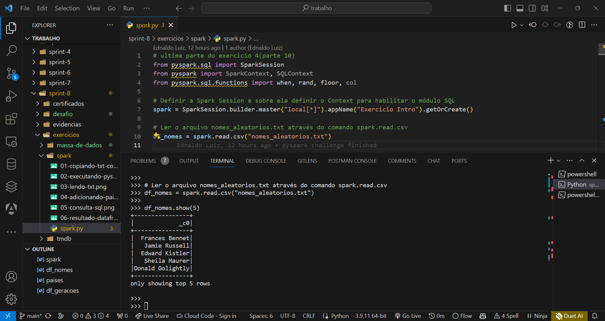
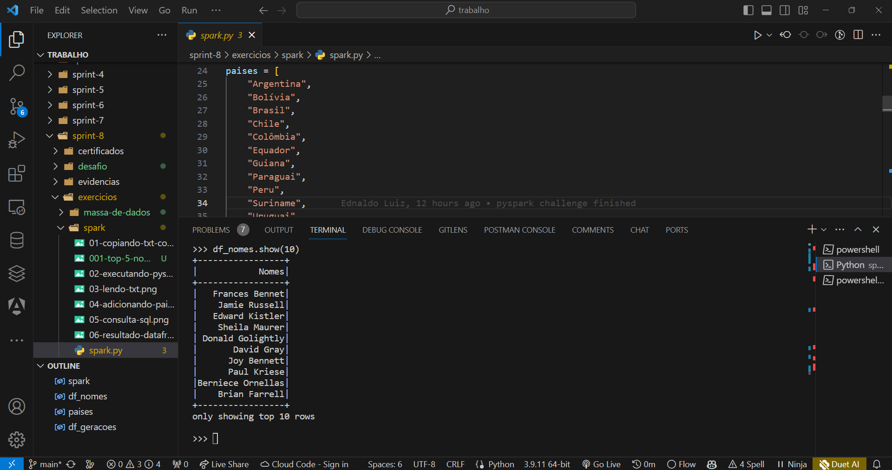
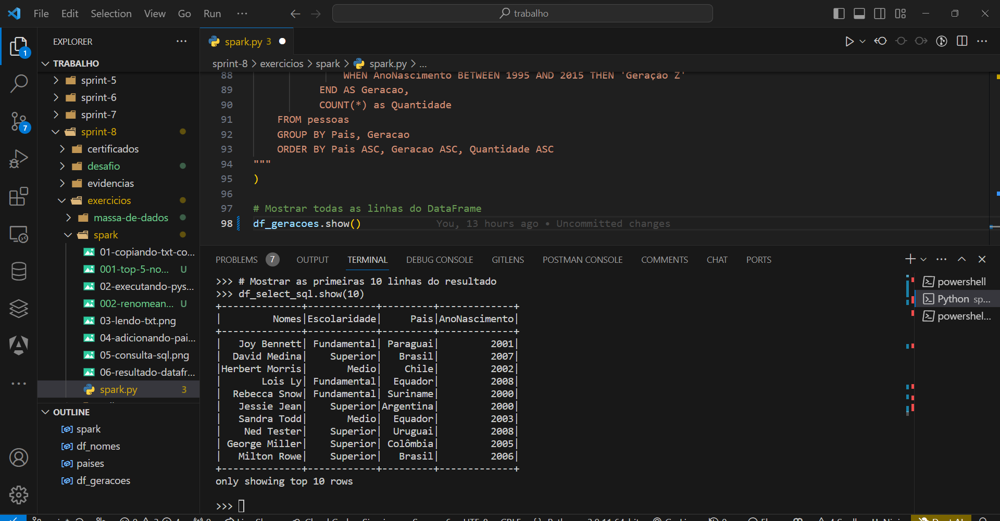
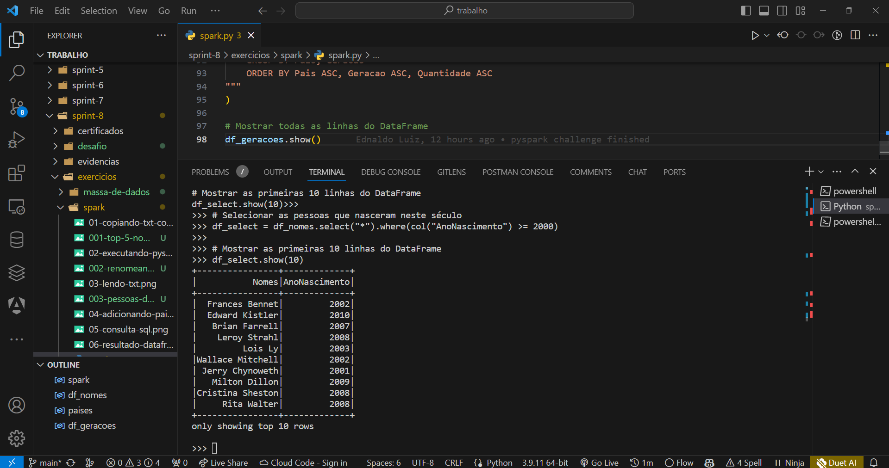
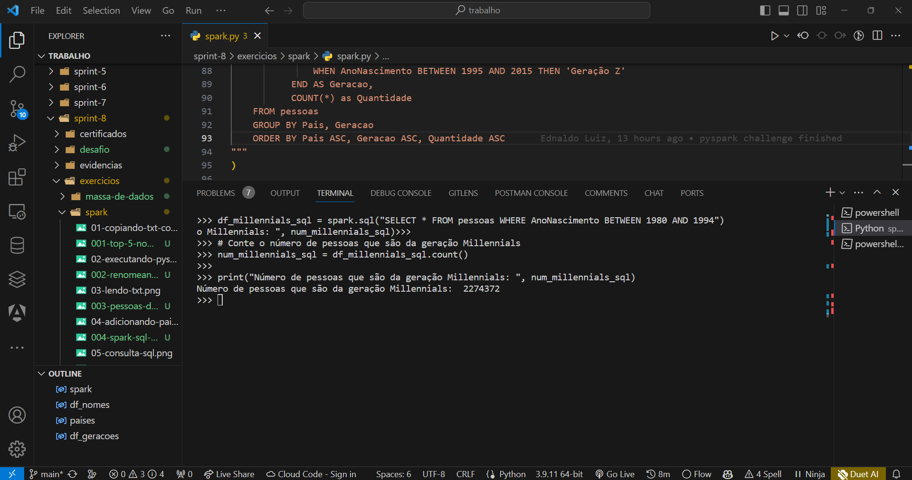
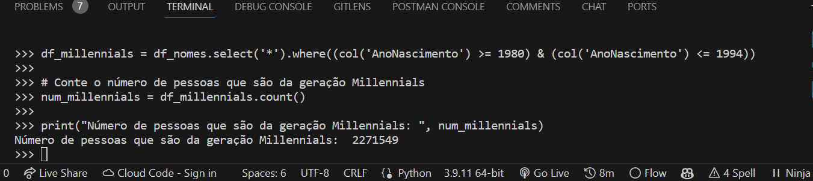
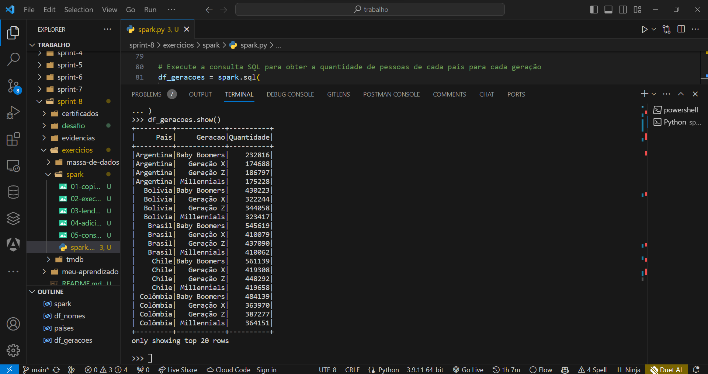

# Etapas Exercício Spark

Todas as 10 etapas numeradas da Udemy

## Etapa 1

Nesta etapa, adicione código para ler o arquivo nomes_aleatorios.txt através do comando spark.read.csv. Carregue-o para dentro de um dataframe chamado df_nomes e, por fim, liste algumas linhas através do método show. Exemplo: df_nomes.show(5)

## Resposta: 

```python
from pyspark.sql import SparkSession
from pyspark import SparkContext, SQLContext
from pyspark.sql.functions import when, rand, floor, col

# Definir a Spark Session e sobre ela definir o Context para habilitar o módulo SQL
spark = SparkSession.builder.master("local[*]").appName("Exercicio Intro").getOrCreate()

# Ler o arquivo nomes_aleatorios.txt através do comando spark.read.csv
df_nomes = spark.read.csv("nomes_aleatorios.txt")

df_nomes.show(5)
```

## Imagem do Resultado:



## Etapa 2

Nesta etapa, será necessário adicionar código para renomear a coluna para Nomes, imprimir o esquema e mostrar 10 linhas do dataframe.

## Resposta: 

```python
df_nomes = df_nomes.withColumnRenamed("_c0", "Nomes")
df_nomes.show(10)
```

## Imagem do Resultado:



## Etapa 3

Ao dataframe (df_nomes), adicione nova coluna chamada Escolaridade e atribua para cada linha um dos três valores de forma aleatória: Fundamental, Medio ou Superior.

Para esta etapa, evite usar funções de iteração, como por exemplo: for, while, entre outras. Dê preferência aos métodos oferecidos para próprio Spark.

## Resposta: 

```python
df_nomes = df_nomes.withColumn(
    "Escolaridade",
    when(rand() < 0.33, "Fundamental").otherwise(
        when(rand() < 0.5, "Medio").otherwise("Superior")
    ),
)
```

## Etapa 4

Ao dataframe (df_nomes), adicione nova coluna chamada Pais e atribua para cada linha o nome de um dos 13 países da América do Sul, de forma aleatória.

Para esta etapa, evite usar funções de iteração, como por exemplo: for, while, entre outras. Dê preferência aos métodos oferecidos para próprio Spark.

## Resposta: 

```python
df_nomes = df_nomes.withColumn(
    "Pais",
    when(rand() < 1 / 13, paises[0]).otherwise(
        when(rand() < 2 / 13, paises[1]).otherwise(
            when(rand() < 3 / 13, paises[2]).otherwise(
                when(rand() < 4 / 13, paises[3]).otherwise(
                    when(rand() < 5 / 13, paises[4]).otherwise(
                        when(rand() < 6 / 13, paises[5]).otherwise(
                            when(rand() < 7 / 13, paises[6]).otherwise(
                                when(rand() < 8 / 13, paises[7]).otherwise(
                                    when(rand() < 9 / 13, paises[8]).otherwise(
                                        when(rand() < 10 / 13, paises[9]).otherwise(
                                            when(
                                                rand() < 11 / 13, paises[10]
                                            ).otherwise(
                                                when(
                                                    rand() < 12 / 13, paises[11]
                                                ).otherwise(paises[12])
                                            )
                                        )
                                    )
                                )
                            )
                        )
                    )
                )
            )
        )
    ),
)
```

## Etapa 5

Ao dataframe (df_nomes), adicione nova coluna chamada AnoNascimento e atribua para cada linha um valor de ano entre 1945 e 2010, de forma aleatória. 

Para esta etapa, evite usar funções de iteração, como por exemplo: for, while, entre outras. Dê preferência aos métodos oferecidos para próprio Spark.

## Resposta: 

```python
df_nomes = df_nomes.withColumn(
    "AnoNascimento", floor(rand() * (2010 - 1945 + 1) + 1945)
)
```

## Etapa 6

Usando o método select do dataframe (df_nomes), selecione as pessoas que nasceram neste século. Armazene o resultado em outro dataframe chamado df_select e mostre 10 nomes deste.

## Resposta: 

```python
# Execute a consulta SQL para selecionar as pessoas que nasceram neste século
df_select_sql = spark.sql("SELECT * FROM pessoas WHERE AnoNascimento >= 2000")

# Mostrar as primeiras 10 linhas do resultado
df_select_sql.show(10)
```

## Imagem do Resultado:



## Etapa 7

Usando Spark SQL repita o processo da Pergunta 6. Lembre-se que, para trabalharmos com SparkSQL, precisamos registrar uma tabela temporária e depois executar o comando SQL. Abaixo um exemplo de como executar comandos SQL com SparkSQL:

df_nomes.createOrReplaceTempView ("pessoas")

spark.sql("select * from pessoas").show()

## Resposta: 

```python
df_nomes = df_nomes.withColumn(
    "AnoNascimento", floor(rand() * (2010 - 1945 + 1) + 1945)
)

# Selecionar as pessoas que nasceram neste século
df_select = df_nomes.select("*").where(col("AnoNascimento") >= 2000)

# Mostrar as primeiras 10 linhas do DataFrame
df_select.show(10)
```

## Imagem do Resultado:



## Etapa 8

Usando o método select do Dataframe df_nomes, Conte o número de pessoas que são da geração Millennials (nascidos entre 1980 e 1994) no Dataset

## Resposta: 

```python
df_millennials_sql = spark.sql("SELECT * FROM pessoas WHERE AnoNascimento BETWEEN 1980 AND 1994")

# Conte o número de pessoas que são da geração Millennials
num_millennials_sql = df_millennials_sql.count()

print("Número de pessoas que são da geração Millennials: ", num_millennials_sql)
```

## Imagem do Resultado:



## Etapa 9

Repita o processo da Pergunta 8 utilizando Spark SQL

## Resposta: 

```python
df_millennials = df_nomes.select('*').where((col('AnoNascimento') >= 1980) & (col('AnoNascimento') <= 1994))

# Conte o número de pessoas que são da geração Millennials
num_millennials = df_millennials.count()

print("Número de pessoas que são da geração Millennials: ", num_millennials)
```

## Imagem do Resultado:



## Etapa 10

Usando Spark SQL, obtenha a quantidade de pessoas de cada país para uma das gerações abaixo. Armazene o resultado em um novo dataframe e depois mostre todas as linhas em ordem crescente de Pais, Geração e Quantidade

- Baby Boomers – nascidos entre 1944 e 1964;

- Geração X – nascidos entre 1965 e 1979;4

- Millennials (Geração Y) – nascidos entre 1980 e 1994;

- Geração Z – nascidos entre 1995 e 2015.

## Resposta: 

```python
df_geracoes = spark.sql(
    """
    SELECT Pais,
           CASE
               WHEN AnoNascimento BETWEEN 1944 AND 1964 THEN 'Baby Boomers'
               WHEN AnoNascimento BETWEEN 1965 AND 1979 THEN 'Geração X'
               WHEN AnoNascimento BETWEEN 1980 AND 1994 THEN 'Millennials'
               WHEN AnoNascimento BETWEEN 1995 AND 2015 THEN 'Geração Z'
           END AS Geracao,
           COUNT(*) as Quantidade
    FROM pessoas
    GROUP BY Pais, Geracao
    ORDER BY Pais ASC, Geracao ASC, Quantidade ASC
"""
)
```

## Imagem do Resultado:

