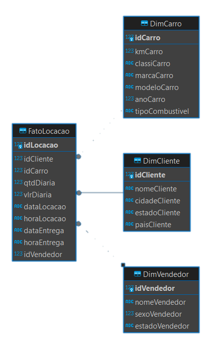
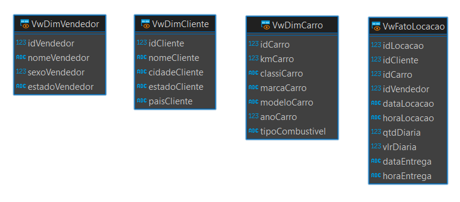

# Exercício 2: Modelagem Dimensional

## Modelagem das Tabelas normalizadas

Este README descreve o processo de modelagem dimensional das tabelas normalizadas proposta no exercício 1, incluindo as motivações para a modelagem, os passos realizados para atingir o resultado final e o diagrama resultante do banco de dados modelado.

## Motivações para a Modelagem Dimensional:

- **Análise de Dados:** A modelagem dimensional facilita a análise de dados, permitindo que sejam vistos sob múltiplas perspectivas.

- **Performance:** A modelagem dimensional melhora a performance das consultas OLAP, que são comumente usadas em Data Warehouses.

- **Simplicidade:** A modelagem dimensional é mais simples e intuitiva, facilitando o entendimento dos dados.

## Passos para a Modelagem Dimensional

### 1. Identificação das Dimensões e Fatos

O primeiro passo é identificar as dimensões e fatos presentes nas tabelas do primeiro exercicio. 
- As dimensões são as entidades sobre as quais queremos analisar os fatos. 
- Os fatos são as métricas ou eventos que queremos analisar.

<div align=center>
      
</div>

Neste caso, as dimensões identificadas foram **Cliente**, **Carro** e **Vendedor**, e o fato foi a **Locação**.

### 2. Criação das Tabelas de Dimensões e Fato

Criei tabelas separadas para cada dimensão e uma tabela para o fato, relacionando-as através de chaves estrangeiras.

#### Script para a criação das Dimensões e Fato:

```sql
-- Criando as Tabelas usadas para as Dimensões e Fato

CREATE TABLE DimCliente (
  idCliente INTEGER NOT NULL PRIMARY KEY,
  nomeCliente VARCHAR(255) NOT NULL,
  cidadeCliente VARCHAR(255),
  estadoCliente VARCHAR(255),
  paisCliente VARCHAR(255)
);

CREATE TABLE DimCarro (
  idCarro INTEGER NOT NULL PRIMARY KEY,
  kmCarro INTEGER,
  classiCarro VARCHAR(255),
  marcaCarro VARCHAR(255),
  modeloCarro VARCHAR(255),
  anoCarro INTEGER,
  tipoCombustivel VARCHAR(255)
);

CREATE TABLE DimVendedor (
  idVendedor INTEGER NOT NULL PRIMARY KEY,
  nomeVendedor VARCHAR(255),
  sexoVendedor SMALLINT(1),
  estadoVendedor VARCHAR(255)
);

CREATE TABLE FatoLocacao (
  idLocacao INTEGER NOT NULL PRIMARY KEY,
  idCliente INTEGER NOT NULL,
  idCarro INTEGER NOT NULL,
  qtdDiaria INTEGER,
  vlrDiaria DECIMAL,
  dataLocacao DATE,
  horaLocacao TIME,
  dataEntrega DATE,
  horaEntrega TIME,
  idVendedor INTEGER,
  FOREIGN KEY (idCliente) REFERENCES DimCliente (idCliente),
  FOREIGN KEY (idCarro) REFERENCES DimCarro (idCarro),
  FOREIGN KEY (idVendedor) REFERENCES DimVendedor (idVendedor)
);
```

### 3. Inserir Dados Normalizados

Após a criação da estrutura dimensional, agora irei inserir os dados correspondentes em cada tabela normalizada para popular as novas tabelas de dimensões, utilizando as cláusulas `INSERT` e `INSERT OR IGNORE` para evitar duplicatas ou violações de chave primária.

#### Script para a inserção dos dados:

```sql
-- Inserts realizados para popular as tabelas com dados de teste das tabelas Cliente, Carro, Vendedor e Locacao

INSERT INTO DimCliente (idCliente, nomeCliente, cidadeCliente, estadoCliente, paisCliente)
SELECT idCliente, nomeCliente, cidadeCliente, estadoCliente, paisCliente FROM Cliente;
 
INSERT INTO DimCarro (idCarro, kmCarro, classiCarro, marcaCarro, modeloCarro, anoCarro, tipoCombustivel)
SELECT idCarro, kmCarro, classiCarro, marcaCarro, modeloCarro, anoCarro, tipoCombustivel FROM Carro;

INSERT INTO DimVendedor (idVendedor, nomeVendedor, sexoVendedor, estadoVendedor)
SELECT idVendedor, nomeVendedor, sexoVendedor, estadoVendedor FROM Vendedor;

INSERT INTO FatoLocacao (idLocacao, idCliente, idCarro, qtdDiaria, vlrDiaria, dataLocacao, horaLocacao, dataEntrega, horaEntrega, idVendedor)
SELECT idLocacao, idCliente, idCarro, qtdDiaria, vlrDiaria, dataLocacao, horaLocacao, dataEntrega, horaEntrega, idVendedor FROM Locacao;
```

## Estrutura do Banco de Dados Dimensional

A estrutura resultante do banco de dados normalizado consiste em várias tabelas separadas para cada entidade identificada, com chaves estrangeiras estabelecendo as relações entre elas.

#### Modelo Dimensional:

<div align=center>
      
</div>

#### Views:

<div align=center>
      
</div>