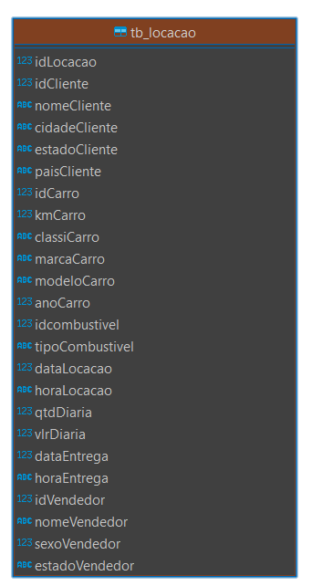
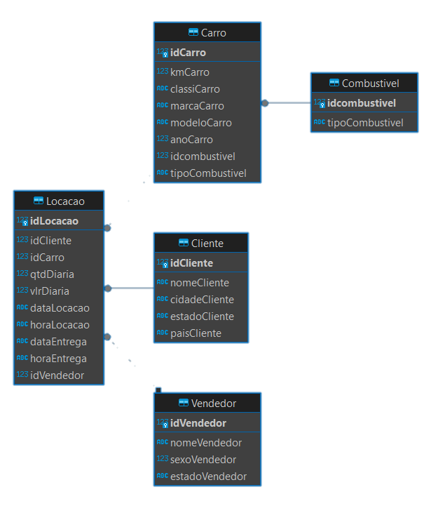

# Exercicío 1: Modelagem Relacional

## Normalização da Tabela tb_locacao

Esse README descreve o processo de normalização da tabela tb_locacao proposta no exercicío 1, incluindo as motivações para a normalização, os passos realizados para atingir o resultado final e o diagrama resultante do banco de dados normalizado.

## Motivações para a Normalização:

- **Redundância de Dados**: A presença de dados duplicados levava a problemas de integridade e consistência.
  
- **Anomalias de Atualização**: A redundância de dados poderia resultar em anomalias durante as atualizações.

- **Dificuldade de Manutenção**: A complexidade e a redundância dos dados dificultavam a manutenção e a garantia de consistência.

## Passos para a Normalização

### 1. Análise da Tabela Original

O primeiro passo é analisar a estrutura da tabela tb_locacao e identificar as dependências funcionais entre os atributos e como podemos fazer para desacoplar essa tabela em tabelas menores.

<div align=center>
      
</div>

### 2. Identificação das Entidades

Apos algumas analises, eu pude identificar as entidades distintas presentes na tabela, como Cliente, Carro, Combustivel, Vendedor e Locação.

#### Motivos por trás da escolha e separação dessas novas entidades:

- **Dependências Funcionais:** Existe uma dependência Funcional entre os atributos da tabela, identificando conjuntos de atributos que determinam outros atributos. Por exemplo, os atributos relacionados aos carros (idCarro, kmCarro, classiCarro, marcaCarro, modeloCarro, anoCarro) dependem diretamente do identificador único do carro.

- **Repetição de Informações:** Levamos em consideração a repetição de informações na tabela, identificando conjuntos de atributos que são frequentemente repetidos em múltiplas linhas. Por exemplo, as informações dos vendedores (idVendedor, nomeVendedor, sexoVendedor, estadoVendedor) são repetidas para cada locação realizada.

### 3. Criação de Tabelas Normalizadas

Criei as tabelas separadas para cada entidade e fiz as relações com a chave estrangeira, removendo as redundâncias e garantindo a integridade dos dados.

#### Script para a criação das novas tabelas:

```sql
-- Tabelas resultantes após a normalização da tabela tb_locacao

CREATE TABLE Cliente (
  idCliente INTEGER NOT NULL PRIMARY KEY,
  nomeCliente VARCHAR(255) NOT NULL,
  cidadeCliente VARCHAR(255),
  estadoCliente VARCHAR(255),
  paisCliente VARCHAR(255)
);

CREATE TABLE Carro (
  idCarro INTEGER NOT NULL PRIMARY KEY,
  kmCarro INTEGER,
  classiCarro VARCHAR(255),
  marcaCarro VARCHAR(255),
  modeloCarro VARCHAR(255),
  anoCarro INTEGER,
  idcombustivel INTEGER NOT NULL,
  tipoCombustivel VARCHAR(255),
  FOREIGN KEY (idcombustivel) REFERENCES Combustivel (idcombustivel)
);

CREATE TABLE Locacao (
  idLocacao INTEGER NOT NULL PRIMARY KEY,
  idCliente INTEGER NOT NULL,
  idCarro INTEGER NOT NULL,
  qtdDiaria INTEGER,
  vlrDiaria DECIMAL,
  dataLocacao DATE,
  horaLocacao TIME,
  idVendedor INTEGER,
  FOREIGN KEY (idCliente) REFERENCES Cliente (idCliente),
  FOREIGN KEY (idCarro) REFERENCES Carro (idCarro),
  FOREIGN KEY (idVendedor) REFERENCES Vendedor (idVendedor)
);

CREATE TABLE Combustivel (
  idcombustivel INTEGER NOT NULL PRIMARY KEY,
  tipoCombustivel VARCHAR(255)
);

CREATE TABLE Vendedor (
  idVendedor INTEGER NOT NULL PRIMARY KEY,
  nomeVendedor VARCHAR(255),
  sexoVendedor SMALLINT(1),
  estadoVendedor VARCHAR(255)
);
```

### 4. Inserir Dados Normalizados

Após a criação da estrutura normalizada, agora irei inserir os dados correspondentes em cada tabela normalizada, utilizando as cláusulas `INSERT` e `INSERT OR IGNORE` para evitar duplicatas ou violações de chave primária.

#### Script para a inserção dos dados:

```sql
-- Inserts realizados para popular as tabelas com os dados da tabela tb_locacao

INSERT INTO Cliente (idCliente, nomeCliente, cidadeCliente, estadoCliente, paisCliente)
SELECT DISTINCT idCliente, nomeCliente, cidadeCliente, estadoCliente, paisCliente
FROM tb_locacao;

INSERT OR IGNORE INTO Carro (kmCarro, classiCarro, marcaCarro, modeloCarro, anoCarro, idcombustivel, tipoCombustivel)
SELECT DISTINCT kmCarro, classiCarro, marcaCarro, modeloCarro, anoCarro, idcombustivel, tipoCombustivel
FROM tb_locacao;

INSERT OR IGNORE INTO Combustivel (idcombustivel, tipoCombustivel)
SELECT DISTINCT idcombustivel, tipoCombustivel
FROM tb_locacao;

INSERT OR IGNORE INTO Vendedor (idVendedor, nomeVendedor, sexoVendedor, estadoVendedor)
SELECT DISTINCT idVendedor, nomeVendedor, sexoVendedor, estadoVendedor
FROM tb_locacao;

INSERT INTO Locacao (idLocacao, idCliente, idCarro, qtdDiaria, vlrDiaria, dataLocacao, horaLocacao, idVendedor)
SELECT DISTINCT idLocacao, idCliente, idCarro, qtdDiaria, vlrDiaria, dataLocacao, horaLocacao, idVendedor
FROM tb_locacao;
```

## Estrutura do Banco de Dados Normalizado

A estrutura resultante do banco de dados normalizado consiste em várias tabelas separadas para cada entidade identificada, com chaves estrangeiras estabelecendo as relações entre elas.

#### Modelo Normalizado:

<div align=center>
      
</div>